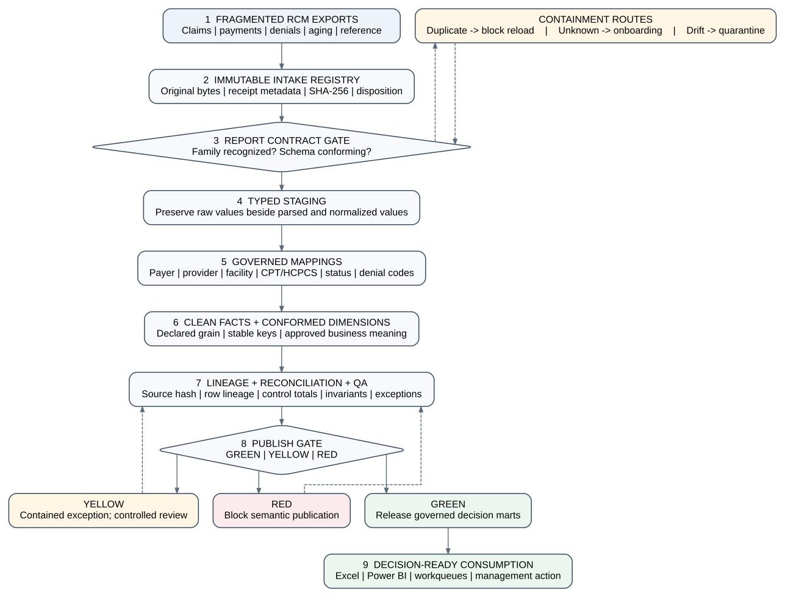

## 4. Governance-First Clean-Room Architecture

### 4.1 Design principles

The architecture is governed by six principles.

**Principle 1: Raw evidence is immutable.** Source files are not corrected in place. Errors are handled through mappings, transformation rules, rejection records, or source replacement. This preserves the ability to reproduce the original state and distinguish source defects from transformation defects.

**Principle 2: Nothing is silently ignored.** Every discovered file receives a disposition such as accepted, duplicate, schema drift, pending onboarding, unsupported, or rejected. An empty inbox is meaningful only when the registry proves where every file went.

**Principle 3: Contracts precede transformations.** A report family is not accepted merely because its filename looks familiar. Its required columns and approved optional columns must satisfy a versioned contract. Contract mismatch is evidence of drift, not an invitation to guess.

**Principle 4: Raw values and business meaning are separate.** Source strings are retained while canonical meanings are assigned through governed cross-reference tables. A mapping is a business decision with ownership, status, and history, not a hidden string-replacement formula.

**Principle 5: Exceptions remain visible until resolved.** An unresolved payer, provider, CPT, denial, reason, remark, facility, point-of-service, or claim-status value is a quality finding. The architecture does not make the dashboard look complete by permanently converting unresolved values to a generic label.

**Principle 6: Publication is gated.** The semantic layer is released only when controls appropriate to the intended use pass. GREEN allows governed publication; YELLOW indicates contained exceptions or conditional use; RED blocks publication.

### 4.2 Source and immutable intake layer

The source layer consists of operational exports such as claim-financial, procedure-level, payment, denial, aging, encounter, and reference reports. The user interaction is intentionally simple: place downloaded files in a controlled inbox. Complexity belongs in the platform, not in an undocumented manual routine.

At intake, the system calculates a SHA-256 fingerprint over the original bytes. The fingerprint supports duplicate detection and provides a stable link between a clean row and its source artifact. A filename alone is insufficient because files can be renamed, replaced, or copied. The registry records filename, hash, size, receipt time, candidate report family, schema signature, disposition, and reason.

Duplicate handling is conservative. A byte-identical file is not loaded twice, but it is not deleted without evidence. Its status points to the previously registered file. This prevents double counting while preserving accountability. Near-duplicate detection—such as two files with the same business period but different content—is a separate control and should not be inferred from hashes alone.

### 4.3 Report-family contracts and schema drift

Each approved report family has a contract. At minimum, the contract defines required columns, optional columns, expected types, declared grain, date basis, financial fields, and business key. Mature implementations should also record source system, report identifier, expected encoding, delimiter, sheet name, header row, version, and effective dates.

The reference implementation treats missing required columns or unexpected unapproved columns as schema drift. A drifted file is quarantined and remains available for review. In production, some changes may be harmless—for example, a new descriptive column—but they should still be reviewed and incorporated into a new contract version. Automatic permissiveness makes the pipeline fragile because a source vendor can change meaning without changing the file extension.

Unknown report families are placed in pending onboarding rather than being discarded or forced into the nearest contract. Onboarding should establish the report’s purpose, grain, keys, date semantics, financial relationships, and mapping requirements before promotion. This turns report discovery into a governed workflow.

### 4.4 Staging and typed source preservation

Accepted files enter a staging layer that preserves source values while applying technical parsing. The staging layer should distinguish raw text from typed interpretations. For example, the original amount string can be retained alongside a parsed decimal, and the original date text can be retained alongside a normalized date. Parse failures should become explicit exceptions with source row numbers.

Staging is also where row counts, null profiles, type conformance, key uniqueness, and basic plausibility are measured. The architecture does not require every report to share the same schema. Instead, each report family is staged according to its contract and later conformed through dimensions, bridges, and facts. This is important for RCM because claim, procedure, payment, denial, encounter, and aging reports often have different grains and cannot be joined safely without declared relationships.

### 4.5 Governed mappings

Cross-reference mappings convert source-specific values into canonical business dimensions. Core domains include payer, provider, facility, point of service, CPT/HCPCS, claim status, denial code, reason code, remark code, staff, and specialty. Each mapping table should retain the raw value, canonical value, classification attributes, approval status, steward, approval timestamp, effective period, and change history.

Mappings are not purely technical. Consider payer normalization. Several source strings may represent the same organization, while similar names may represent different products, administrators, or lines of business. A mapping rule must therefore be based on evidence rather than string similarity alone. The same applies to provider specialty, claim-status grouping, and denial classification.

The architecture uses completeness rules at the semantic boundary. If an accepted record contains an unmapped payer, the clean row may temporarily carry an explicit technical sentinel for processing, but the publish gate fails. This sentinel is not presented as a valid analytical category. The exception table records the source file, record key, domain, and raw value so that a steward can make a controlled decision.

### 4.6 Clean facts and conformed dimensions

The clean layer contains typed, reconciled, semantically governed records at declared grains. Typical facts include claim financial, claim-procedure financial, CPT aging, CPT denial, provider payment, claim action, and encounter visit. Conformed dimensions support consistent slicing across facts where shared identifiers and semantics exist.

The architecture rejects fabricated relationships. If an encounter export and a claim export lack a reliable shared identifier, a bridge is not created through fuzzy matching merely to complete a model. Each fact can remain independently valid, with the missing relationship documented as a source limitation. This is preferable to a plausible but unverifiable join that contaminates downstream metrics.

Financial facts enforce equations appropriate to their source. The synthetic claim fact uses:

> **Charge amount = Payment amount + Adjustment amount + Balance amount**

within a tolerance of one cent. Production contracts may use different equations depending on whether refunds, transfers, patient payments, reversals, and contractual adjustments are separated. The critical requirement is that the equation be declared, testable, and tied to the report’s grain and date basis.

### 4.7 Lineage and reconciliation

Every clean record should retain or resolve to the ingestion run, source file, source hash, source row, transformation version, mapping version, and target business key. Aggregate reconciliation then connects source counts and totals to staging, rejection, and clean outputs.

A complete run answers:

- how many files were discovered;
- how many were accepted, duplicated, drifted, pending, or rejected;
- how many source rows were read;
- how many rows were staged, rejected, and promoted;
- whether charge, payment, adjustment, balance, and denial totals reconciled;
- which mappings were unresolved;
- which controls determined the final status.

This evidence supports reproducibility and operational investigation. It also reduces the risk of a “successful” refresh that silently loaded fewer rows than expected.

### 4.8 QA controls and publication gates

Controls are evaluated as discrete, evidence-producing tests. The supplied matrix groups controls across intake, contracts, semantics, finance, integrity, lineage, reconciliation, publication, and privacy. Each control has an identifier, risk statement, test, threshold, severity, and required action.

The overall status is deterministic:

- **RED** when any blocking control fails, including unresolved mappings in accepted data, financial reconciliation errors, orphan keys, missing lineage, privacy exposure, or incorrect gate logic;
- **YELLOW** when no blocking control fails but contained exceptions or required reviews remain, such as safely quarantined duplicates, recognized schema drift, or pending report onboarding;
- **GREEN** when all required controls for the intended publication pass.

The status is not a sentiment. A team cannot relabel RED as GREEN because a deadline is approaching. Overrides, where permitted, require an accountable owner, stated scope, expiration, and evidence. The design therefore separates technical execution success from semantic publication readiness. A pipeline can run successfully and still return RED.

### 4.9 Decision marts and reporting

Only governed outputs reach decision marts. The mart layer presents stable, documented measures for Excel, Power Query, Power Pivot, Power BI, or other analytical tools. Example outputs include payer financial performance, denial trends, aging distributions, provider productivity, procedure yield, exception queues, and data-trust summaries.

A decision-ready measure requires more than a formula. It needs a grain, numerator, denominator, date basis, inclusion rules, exclusion rules, source coverage statement, and validation status. Net collection rate, for example, is not defensible if charges and payments use incompatible periods or if adjustments are missing. The architecture therefore treats metric metadata and source coverage as part of governance.

### 4.10 Privacy and public-research boundary

The reference implementation contains no patient names, dates of birth, addresses, medical record numbers, account numbers, or real claim identifiers. All identifiers and amounts are generated. Production use would require organizational security, access control, encryption, retention, incident response, business-associate obligations, and legal review appropriate to the environment. HHS de-identification guidance is relevant when protected information is transformed for secondary use, but de-identification alone does not resolve employer ownership, contractual confidentiality, or the risk created by combining datasets (U.S. Department of Health and Human Services, n.d.).

The public/private boundary is therefore architectural. Public repositories may contain code, contracts, synthetic fixtures, schemas, tests, and documentation. They must not contain client raw files, screenshots with identifiers, credentials, connection strings with secrets, or operational extracts. A privacy control is a RED gate because a technically valid pipeline is not publishable if the artifact exposes protected or proprietary information.
